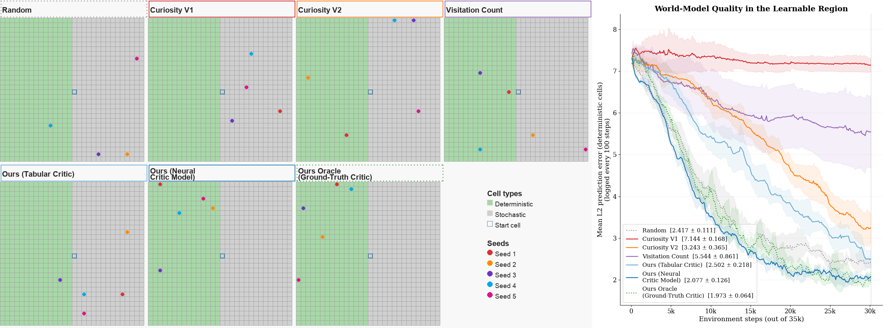

## Curiosity-Critic: Cumulative Prediction Error Improvement as a Tractable Intrinsic Reward for World Model Training

*Vin Bhaskara and Haicheng Wang, University of Toronto, 2026.*  
\{bhaskara,hcwang\}@cs.toronto.edu    

Paper: [arxiv.org/abs/2604.18701](https://arxiv.org/abs/2604.18701)

Abstract:
> Local prediction-error-based curiosity rewards focus on the current transition without considering the world model's cumulative prediction error across all visited transitions. We introduce Curiosity-Critic, which grounds its intrinsic reward in the improvement of this cumulative objective, and show that it reduces to a tractable per-step form: the difference between the current prediction error and the asymptotic error baseline of the current state transition. We estimate this baseline online with a learned critic co-trained alongside the world model; regressing a single scalar, the critic converges well before the world model saturates, redirecting exploration toward learnable transitions without oracle knowledge of the noise floor. The reward is higher for learnable transitions and collapses toward the baseline for stochastic ones, effectively separating epistemic (reducible) from aleatoric (irreducible) prediction error online. Prior prediction-error curiosity formulations, from Schmidhuber (1991) to learned-feature-space variants, emerge as special cases corresponding to specific approximations of this baseline. Experiments on a stochastic grid world show that Curiosity-Critic outperforms prediction-error and visitation-count baselines in convergence speed and final world model accuracy.

Correspondence: [vin.bhaskara@gmail.com](mailto:vin.bhaskara@gmail.com)

### 1. Reproduce Experiments
---

**Run Script**:  
```bash
pip install -r requirements.txt
chmod +x run.sh && ./run.sh
```

**Live animation**: [youtu.be/Jv1n346TWbQ](https://youtu.be/Jv1n346TWbQ)

<figure>
  
  <figcaption>
    <span class="caption">Five methods explore a 30x30 grid world. The left half (green) is learnable; the right half (grey) is pure noise.</span>
  </figcaption>
</figure>

### 2. Experiment Details
---


#### Environment

A **30 × 30 grid world** with a hard left/right split:

```
         col  0         1         2
              012345678901234567890123456789
    row  0    DDDDDDDDDDDDDDD···············
         ⋮    (rows 1–14: same split)
    row 15    DDDDDDDDDDDDDDS···············   ← agent start (15, 15)
         ⋮    (rows 16–29: same split)
    row 29    DDDDDDDDDDDDDDD···············

    D = deterministic cell (cols 0–14)  — 450 cells, 50% of grid
    · = stochastic cell    (cols 15–29) — 450 cells, 50% of grid
    S = agent start
```

| Property | Value |
|---|---|
| Grid size | 30 × 30 |
| Observation | 200-dim binary vector ("TV pixels") per cell |
| Deterministic region | All rows, cols 0–14 |
| Stochastic region | All rows, cols 15–29 |
| Agent start | (15, 15) — center, stochastic side of boundary |
| Actions | Up / Down / Left / Right (hard walls, no wrap) |
| Transitions | Fully deterministic |

**Deterministic cells** share a fixed binary pattern derived from cyclic shifts of a base random vector (seeded by `GRID_SEED = 28081994`). Adjacent cells have correlated patterns, enabling the world model to generalise across nearby cells. Prediction error is reducible to zero.

**Stochastic cells** re-sample an i.i.d. Bernoulli(0.5) vector on every visit. Prediction error is irreducible — the oracle floor is `sqrt(200) × 0.5 ≈ 7.07`.


#### World Model

Two-layer MLP trained online with one Adam step per environment step:

```
Input  : [one-hot(row) | one-hot(col)]   →  60-dimensional
Hidden : Linear(60 → 1024) → ReLU
Output : Linear(1024 → 200)              [raw logits, no activation]

Loss   : MSELoss(logits, true_pixels)
Optim  : Adam  (lr=0.001, β₁=0.9, β₂=0.999, ε=1e-8)
```


#### Neural Critic Model (`CriticNNetModel`)

Trained online to predict `error_after` at each state:

```
Input  : [one-hot(row) | one-hot(col)]   →  60-dimensional
Hidden : Linear(60 → 128) → ReLU
Output : Linear(128 → 1)                 [scalar, clamped to ≥ 0]

Loss   : MSELoss(predicted_error_after, observed_error_after)
Optim  : Adam  (lr=0.001, β₁=0.9, β₂=0.999, ε=1e-8)
```

One gradient update per step, applied before the reward is computed. The smaller hidden size (128 vs. 1024) reflects the easier scalar regression target.


### 3. Methods
---

| Key | Display Name | Intrinsic Reward |
|---|---|---|
| `random` | Random | Uniform random actions — unguided baseline |
| `curiosity_v1` | Curiosity V1 | `error_before` — raw L2 prediction error (Schmidhuber, Feb 1991) |
| `curiosity_v2` | Curiosity V2 | `error_before − error_after` — change in prediction error (Schmidhuber, Nov 1991) |
| `visitation_count` | Visitation Count | `1 / sqrt(N(s))` — count-based bonus (Strehl & Littman, 2008) |
| `curiosity_critic_ours_tabular_critic` | Ours (Tabular Critic) | `error_before − EMA-mean(error_after)` per state, decay=0.9 |
| `curiosity_critic_ours_nnet` | Ours (Neural Critic Model) | `error_before − CriticNNetModel.predict(state)` |
| `curiosity_critic_ours_ideal` | Ours Oracle (Ground-Truth Critic) | `error_before − irreducible_error(state)` — oracle upper bound |

**Tabular Critic** (`CriticBaselineEstimation`): 30×30 table of per-state EMA-mean values (decay=0.9) tracking `error_after`. No oracle knowledge required.

**Neural Critic** (`CriticNNetModel`): replaces the table with a small MLP that generalises across states via shared row/column embeddings.

**Oracle**: uses the analytical irreducible error (7.07 for stochastic, 0.0 for deterministic). Requires ground-truth knowledge of cell type; included as an ideal upper bound.


### 4. Policy
---

Tabular **V-table** (30×30), ε-greedy:

```
V(s) ← V(s) + α · [ r_norm + γ · max_{a ∈ valid(s)} V(step(s, a)) − V(s) ]
```

Rewards are normalised by a running EMA-std estimate (decay=0.95) before the V-table update to decouple reward scale from the learning rate.


### 5. Evaluation Metrics
---

Recorded every 100 steps:

1. **Mean L2 prediction error on deterministic cells** (primary) — each of the 450 deterministic cells is queried directly; the L2 norm of `‖prediction − true_pixels‖₂` is averaged. Lower is better.
2. **Fraction of steps in the deterministic region** (secondary) — measures how effectively each method directs the agent toward learnable states.


### 6. Results
---

Under `results/` folder.

| File | Description |
|---|---|
| `error.png` | Mean L2 error over full training, mean ± std across seeds |
| `zoomed_error.png` | Final 10k steps (excl. Curiosity V1, Visitation Count) |
| `error_w_zoom.png` | Side-by-side: full run + zoomed last 10k steps |
| `final_error_table.txt` | LaTeX `booktabs` table of final error per method × seed |
| `critic_convergence.png` | Neural critic mean estimate vs. oracle over training, separately for deterministic and stochastic cells, mean ± std across seeds |
| `visit_frac.png` | Fraction of steps in deterministic region over time |
| `heatmap_end.png` | Seed-averaged visitation heatmaps at end of training |
| `heatmap_windows.png` | Heatmaps at early / mid / late training windows |


### 7. Cite
---  

Cite as:  
```
@misc{bhaskara2026curiositycriticcumulativepredictionerror,
      title={Curiosity-Critic: Cumulative Prediction Error Improvement as a Tractable Intrinsic Reward for World Model Training}, 
      author={Vin Bhaskara and Haicheng Wang},
      year={2026},
      eprint={2604.18701},
      archivePrefix={arXiv},
      primaryClass={cs.LG},
      url={https://arxiv.org/abs/2604.18701}, 
}
```


